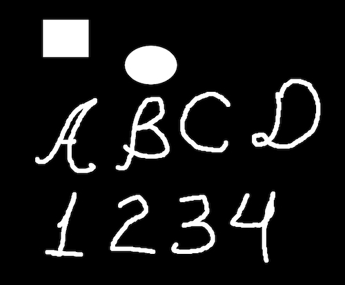
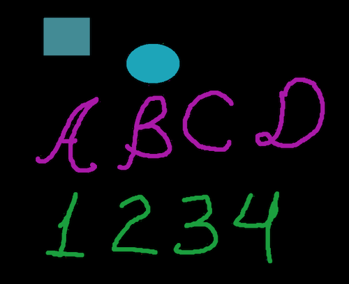
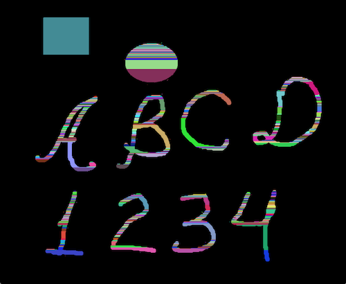
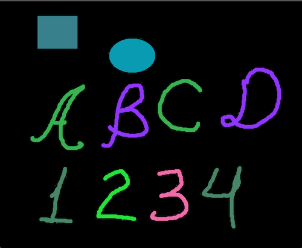
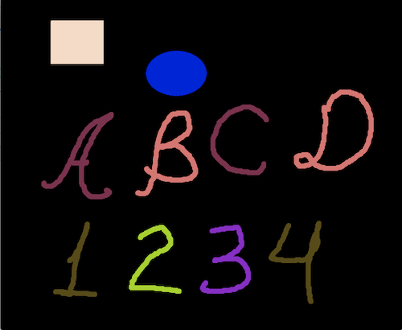
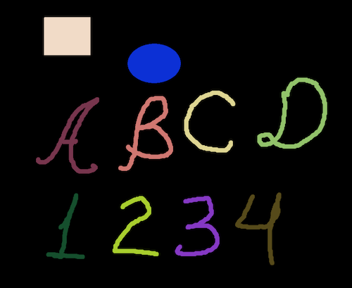
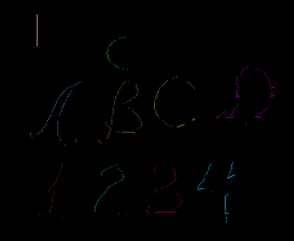
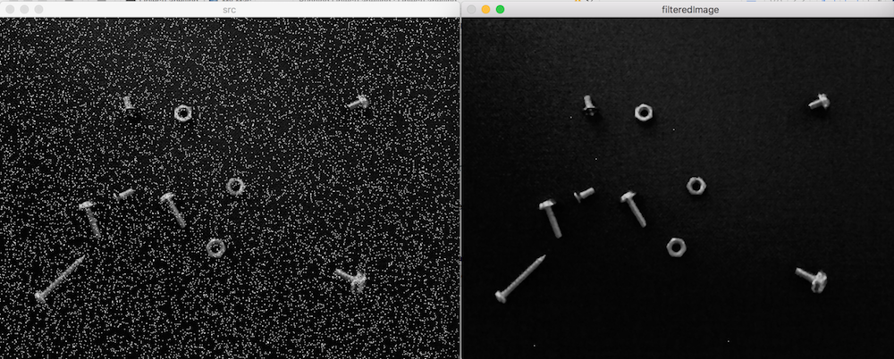
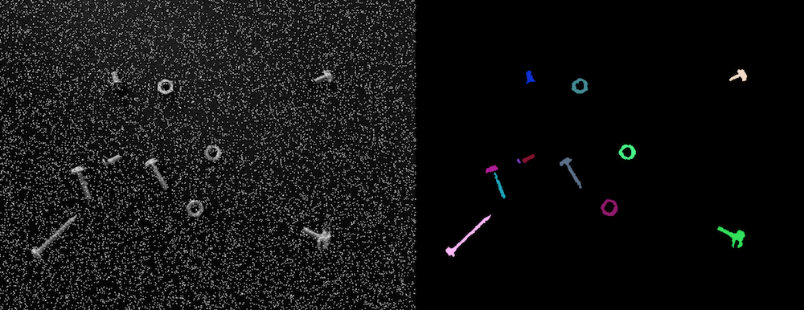

-- Original image

-- v1 mixed blobs

-- v2 : too much blobs

-- v3 : I did it

-- v3 : Add simple threshhold

-- v4 :  CV_16SC1 --> CV_32SC1

-- finding border v1

-- Median filter - perfect

-- Simple threshold method

